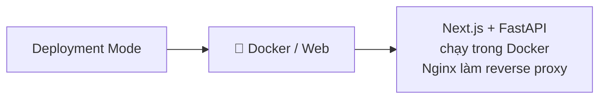
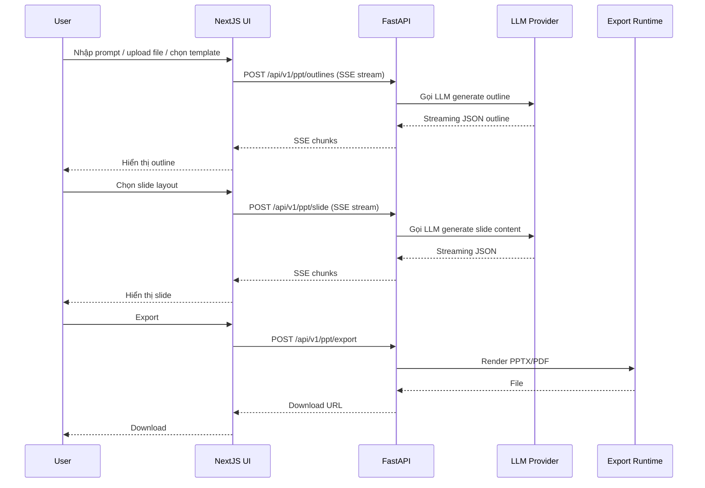

# Level 0 — Tổng quan dự án

## 📌 Presenton là gì?

Presenton là một **open-source AI Presentation Generator** (thay thế Gamma, Canva, Beautiful AI, Decktopus...). Cho phép:

- Tạo presentation từ **prompt**, từ **document upload**, hoặc từ **PowerPoint template có sẵn**
- Tùy chọn **AI provider**: OpenAI, Anthropic, Google Gemini, Vertex AI, Azure OpenAI, Amazon Bedrock, Fireworks, Together AI, **Ollama**, hoặc bất kỳ provider nào OpenAI-compatible
- **Self-hosted** hoàn toàn (Docker / Desktop App)
- **Editable PPTX export** — file xuất ra chỉnh sửa được trong PowerPoint
- **REST API** đầy đủ

## 🧱 Tech Stack

| Layer | Công nghệ |
|-------|-----------|
| Frontend | **Next.js 16** (App Router) + React 19 + Redux Toolkit + TailwindCSS + Radix UI |
| Slide Editor | **Konva** (canvas) + Tiptap (rich text) + dnd-kit + Babel (compile layout runtime) |
| Backend | **FastAPI** (Python) + SQLAlchemy + Alembic + Uvicorn |
| Database | **SQLite** (mặc định) với Alembic migrations |
| Auth | OAuth2 PKCE + session cookie + custom middleware |
| AI Providers | OpenAI / Anthropic / Google / Vertex / Bedrock / Ollama / OpenAI-compatible |
| Document Extraction | `@llamaindex/liteparse` |
| Export runtime | Chromium-based (Playwright/Puppeteer) + Python (python-pptx) |
| Reverse Proxy | Nginx |
| Build | uv (Python) + npm (Node) |

## 📦 Kiểu triển khai

Presenton hỗ trợ **2 deployment mode**:

### 1. Docker / Web
- `docker-compose.yml` chạy Nginx + NextJS + FastAPI
- Nginx serve `/static` & `/app_data` và proxy `/api/*` tới FastAPI
- `start.js` là orchestrator để dev: khởi động FastAPI (uvicorn) + NextJS (`next dev`)

## 🚪 Entry points chính

| Entry | File | Vai trò |
|-------|------|---------|
| Docker / Web entry | `start.js` | Orchestrator: setup env, spawn FastAPI + NextJS, quản lý log |
| FastAPI entry | `servers/fastapi/server.py` | Chạy uvicorn với `api.main:app` |
| FastAPI app | `servers/fastapi/api/main.py` | Khởi tạo FastAPI app + routers + middlewares |
| NextJS entry | `servers/nextjs/proxy.ts` | Proxy `/api/v1`, `/app_data`, `/static` → FastAPI |

## 📡 Giao tiếp chính

| Client → Server | Method | Mục đích |
|-----------------|--------|----------|
| Browser → NextJS | HTTP | Render UI, SSR/RSC |
| Browser → FastAPI (qua NextJS proxy) | HTTP | API calls |
| NextJS (BFF) → FastAPI | `fetch` | LLM streaming, export, file upload |

## 🔄 Luồng tính năng chính

