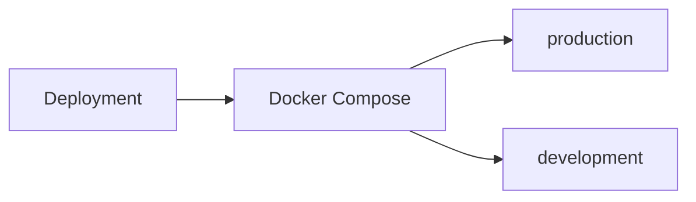
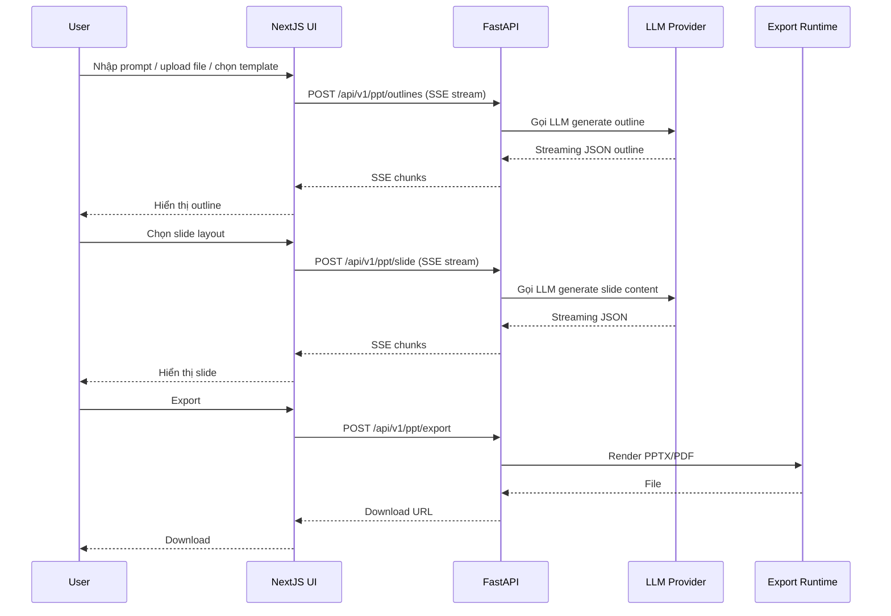

# Level 0 — Tổng quan dự án

## 📌 Presenton là gì?

Presenton là một **open-source AI Presentation Generator** (thay thế Gamma, Canva, Beautiful AI, Decktopus...). Cho phép:

- Tạo presentation từ **prompt**, từ **document upload**, hoặc từ **PowerPoint template có sẵn**
- Tùy chọn **AI provider**: OpenAI, Google Gemini, hoặc bất kỳ endpoint OpenAI-compatible nào (vLLM / LiteLLM proxy / Ollama trên server AI riêng)
- **Self-hosted** hoàn toàn qua Docker (web app). Không còn Electron desktop hay MCP server.
- **Editable PPTX export** — file xuất ra chỉnh sửa được trong PowerPoint
- **REST API** đầy đủ

## 🧱 Tech Stack

| Layer | Công nghệ |
|-------|-----------|
| Frontend | **Next.js 16** (App Router) + React 19 + Redux Toolkit + TailwindCSS + Radix UI |
| Slide Editor | **Konva** (canvas) + Tiptap (rich text) + dnd-kit + Babel (compile layout runtime) |
| Backend | **FastAPI** (Python) + SQLAlchemy + Alembic + Uvicorn |
| Database | **SQLite** (mặc định) với Alembic migrations |
| Auth | OAuth2 PKCE + session cookie + custom middleware |
| AI Providers | OpenAI / Google Gemini / OpenAI-compatible (`custom`). FastAPI gọi native `openai` + `google-genai` SDK (không còn `llmai`). Inference chạy trên API từ xa — container Presenton không cần GPU. |
| Document Extraction | `@llamaindex/liteparse` |
| Export runtime | Chromium-based (Playwright/Puppeteer) + Python (python-pptx) |
| Reverse Proxy | Nginx |
| Build | uv (Python) + npm (Node) |

## 📦 Kiểu triển khai

Presenton hỗ trợ **1 kiểu triển khai**: Docker / Web.

### Docker / Web

- `docker-compose.yml` có hai service: **`production`** (image từ `Dockerfile`) và **`development`** (hot-reload từ `Dockerfile.dev`)
- Không có `production-gpu` / `development-gpu`. GPU (nếu dùng) thuộc server LLM riêng, Presenton chỉ HTTP client (`CUSTOM_LLM_URL`, `MEM0_LLM_BASE_URL`, image APIs)
- Nginx trong image serve `/static` & `/app_data` và proxy `/api/*` tới FastAPI
- `start.js` là orchestrator: khởi động FastAPI (uvicorn) + NextJS (`next dev` hoặc production)

## Phạm vi fork (web-only)

So với upstream Presenton, fork này:

| Đã bỏ | Thay bằng |
|-------|-----------|
| Electron desktop app | Docker web only |
| MCP server (`/mcp`) | REST API + Admin API keys |
| Nhiều cloud LLM (Anthropic, Azure, Bedrock, Ollama-in-app, Codex, …) | `openai` / `google` / `custom` |
| Image local (ComfyUI, Pexels, Pixabay, …) | `gpt-image-1.5` / `gemini_flash` / `nanobanana_pro` / `openai_compatible` |
| Web search Tavily / Exa / Brave | `auto` (native GPT/Gemini + SearXNG cho custom) |
| GPU compose profiles | CPU container; LLM self-host qua API |

## 🚪 Entry points chính

| Entry | File | Vai trò |
|-------|------|---------|
| Docker / Web entry | `start.js` | Orchestrator: setup env, spawn FastAPI + NextJS, quản lý log |
| FastAPI entry | `servers/fastapi/server.py` | Chạy uvicorn với `api.main:app` |
| FastAPI app | `servers/fastapi/api/main.py` | Khởi tạo FastAPI app + routers + middlewares |
| NextJS entry | `servers/nextjs/proxy.ts` | Proxy `/api/v1`, `/app_data`, `/static` → FastAPI |

## 📡 Giao tiếp chính

| Client → Server | Method | Mục đích |
|-----------------|--------|----------|
| Browser → NextJS | HTTP | Render UI, SSR/RSC |
| Browser → FastAPI (qua NextJS proxy) | HTTP | API calls |
| NextJS (BFF) → FastAPI | `fetch` | LLM streaming, export, file upload |

## 🔄 Luồng tính năng chính

