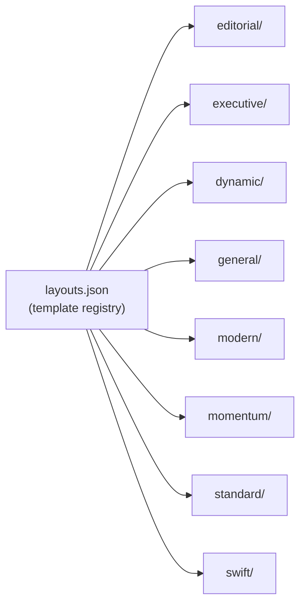
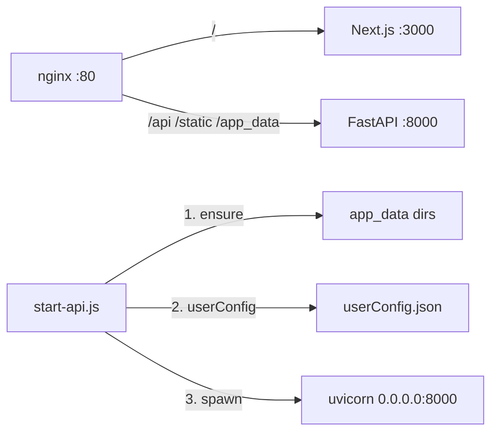

# Level 1 — Workspace root

Workspace root của presenton là một **monorepo** chứa nhiều sub-project độc lập nhưng hoạt động phối hợp với nhau.

## 📂 Sơ đồ thư mục gốc

```mermaid
graph TD
    Root["presenton/<br/>(monorepo root)"]

    Root --> Config["⚙️ Config & Docs"]
    Root --> Servers["🖥️ servers/"]
    Root --> Export["📦 presentation-export/"]
    Root --> DocExtract["📄 document-extraction-liteparse/"]
    Root --> Templates["🎨 templates/"]
    Root --> Scripts["🔧 scripts/"]
    Root --> AppData["📁 app_data/ (runtime data)"]
    Root --> Infra["🐳 Infra (Docker/Nginx)"]

    Config --> Readme["README.md, LICENSE, NOTICE"]
    Config --> Vision["VISION.md"]
    Config --> Contrib["CONTRIBUTING.md"]
    Config --> Env[".env.example"]
    Config --> DoFiles[".do/"]

    Servers --> FastAPI["fastapi/<br/>🐍 Python Backend"]
    Servers --> NextJS["nextjs/<br/>⚛️ React Frontend"]

    Export --> Py["py/<br/>Python export helpers"]
    Export --> Node["index.js, index.cjs"]

    DocExtract --> Lite["LlamaIndex LiteParse<br/>(PDF/DOCX/PPTX)"]

    Templates --> TmplList["editorial, executive, dynamic,<br/>general, modern, momentum,<br/>standard, swift"]

    Scripts --> Conv["convert-template.mjs"]
    Scripts --> Sync["sync-presentation-export.cjs"]
    Scripts --> Banner["gslide-ascii.txt + gslide-terminal-banner.mjs"]
    Scripts --> Tests["*.test.mjs"]

    Infra --> Dockerfile["Dockerfile.web / Dockerfile.api"]
    Infra --> NginxConf["nginx.conf"]
    Infra --> DockerCompose["docker-compose.yml"]
```



## 📋 Mục đích từng thư mục

| Thư mục | Mục đích | Ghi chú |
|---------|----------|---------|
| `servers/` | Chứa 2 server chính của app | Xem [02-level-servers.md](./02-level-servers.md) |
| `presentation-export/` | Chromium-based runtime xuất PPTX/PDF | Dùng bởi Docker build |
| `document-extraction-liteparse/` | Document parsing cho upload | Workspace con phục vụ FastAPI |
| `templates/` | Template có sẵn cho user | Mỗi folder = 1 template design |
| `app_data/` | Runtime data (uploads, exports, fonts, ...) | Mount qua volume trong Docker |
| `scripts/` | Build/conversion/test scripts | Chạy qua npm scripts ở root |
| `docs/` | Tài liệu dự án | Folder này! |
| `.do/` | App deployment configs (DigitalOcean?) | Có thể là nơi chứa deploy recipes |

## 🎨 Thư mục Templates

Templates là các **slide layout designs** đóng gói sẵn để user chọn. Mỗi template folder chứa JSON layouts (`layouts.json` ở root làm registry).



Các template này được **copy vào `app_data/templates/`** lúc runtime.

## 🐳 Infrastructure

| File | Vai trò |
|------|---------|
| `Dockerfile.web` / `Dockerfile.api` | Production images (Next only / FastAPI+Chromium) |
| `Dockerfile.dev.web` / `Dockerfile.dev.api` | Dev images, hot-reload |
| `docker-compose.yml` | `production`/`development` = nginx; plus `web`/`api` or `web-dev`/`api-dev` + `searxng` |
| `nginx.conf` | Reverse proxy: `/` → Next (`web:3000`), `/api/*` `/static/` `/app_data/` → FastAPI (`api:8000`) |
| `.env.example` | Template cho environment variables |

## ⚙️ Root package.json scripts

```jsonc
{
  "test": "npm run test:template-converter && node --test scripts/package-metadata.test.mjs",
  "convert:template": "node scripts/convert-template.mjs",
  "convert:presentation-template": "node scripts/convert-presentation-template.mjs",
  "sync:presentation-export": "node scripts/sync-presentation-export.cjs",
  "check:presentation-export": "node scripts/sync-presentation-export.cjs --check-only"
}
```

Root chỉ có vài script orchestration — các script chính của NextJS/FastAPI nằm trong từng sub-project.

## 🚦 Entrypoints

Compose starts **nginx** (`production` / `development`), **Next** (`web` / `web-dev`), and **FastAPI** (`api` / `api-dev` via `scripts/start-api.js`).



Internal ports (not published on the host by default):

| Service | Port |
|---------|------|
| FastAPI | `8000` |
| Next.js | `3000` |
| nginx (host) | `5001` → `80` |

## 🧪 Test scripts

Có 2 nhóm test:

- **Node tests (root)**: `npm test` → chạy template converter tests + package metadata test
- **Python tests**: `servers/fastapi/tests/` (pytest)
- **Frontend E2E**: `servers/nextjs/cypress/`

## 📦 Workspace dependencies (root)

```json
{
  "@llamaindex/liteparse": "^1.5.2",
  "sharp": "^0.34.5"
}
```

Root chỉ cài `sharp` (cho NextJS Image optimization) và `liteparse` (cho document extraction).
