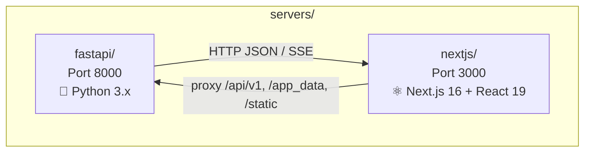
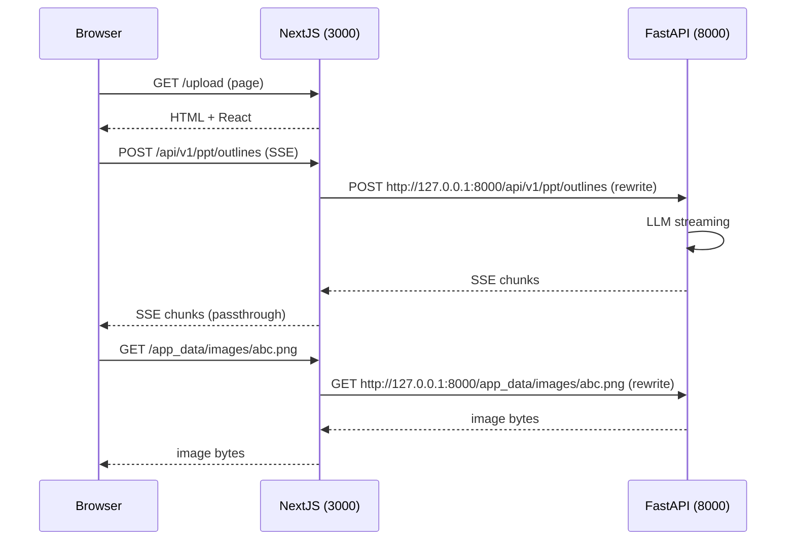
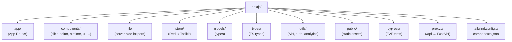
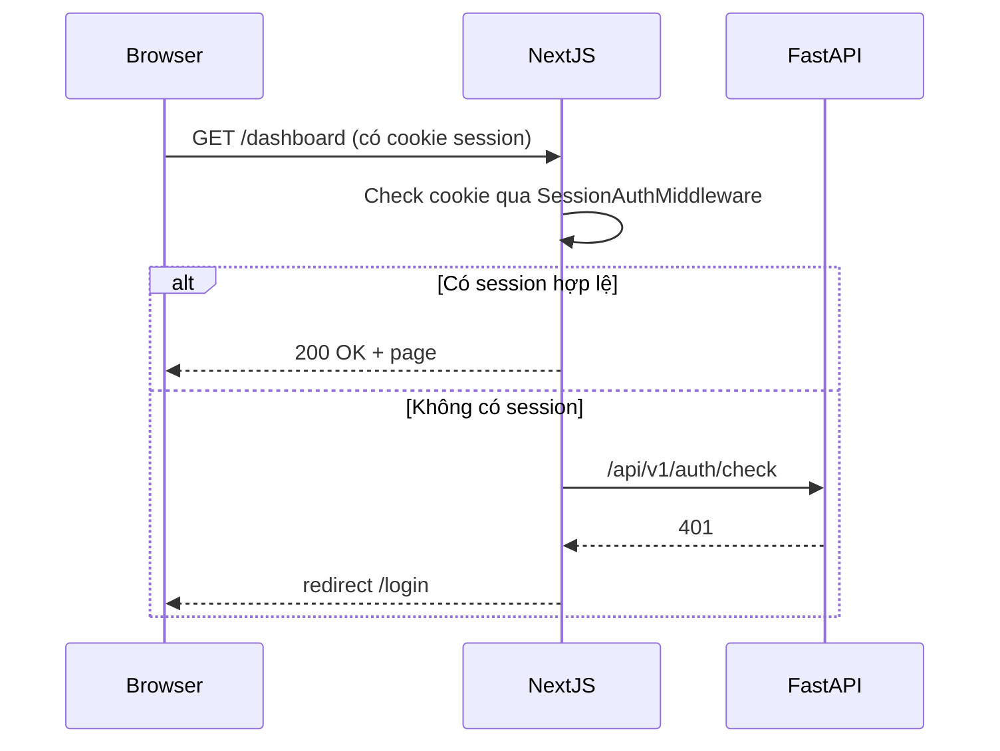

# Level 2 — Servers (FastAPI + NextJS)

Presenton chạy 2 server song song:

- **FastAPI** (Python) — xử lý AI, business logic, auth, export
- **NextJS** (Node) — UI, BFF, proxy `/api/*` → FastAPI

## 📂 Sơ đồ tổng thể

## 🔌 Cách 2 server giao tiếp

Proxy logic ở `servers/nextjs/proxy.ts`:

- `/api/v1`, `/api/v1/*`, `/api/v2`, `/api/v2/*` → forward tới FastAPI
- `/app_data`, `/app_data/*`, `/static`, `/static/*` → forward tới FastAPI
- Auth check trên `/api/*` (trừ một số path public)

## 🐍 FastAPI (Python) — `servers/fastapi/`

```mermaid
graph TB
    FastAPI[fastapi/]

    FastAPI --> Server["server.py<br/>(uvicorn entry)"]
    FastAPI --> Main["api/main.py<br/>(FastAPI app + routers)"]
    FastAPI --> Api["api/<br/>(main + v1 endpoints)"]
    FastAPI --> Services["services/<br/>(business logic)"]
    FastAPI --> Models["models/<br/>(pydantic + SQL)"]
    FastAPI --> Utils["utils/<br/>(helpers, LLM clients)"]
    FastAPI --> Constants["constants/<br/>(LLM, documents, presentation)"]
    FastAPI --> Enums["enums/"]
    FastAPI --> Alembic["alembic/<br/>(DB migrations)"]
    FastAPI --> Tests["tests/<br/>(pytest)"]
    FastAPI --> Static["static/<br/>(SVG icons, themes, ...)"]
    FastAPI --> Templates["templates/<br/>(jinja?)"]
    FastAPI --> Assets["assets/<br/>(icon vectorstore)"]
    FastAPI --> Scripts["scripts/"]
    FastAPI --> Migrations["migrations.py"]
```

Chi tiết xem [03-level-fastapi.md](./03-level-fastapi.md).

## �️ NextJS (Node) — `servers/nextjs/`

Chi tiết xem [04-level-nextjs.md](./04-level-nextjs.md).

## 🗺️ Bảng đối chiếu: URL nào thuộc server nào?

| URL Pattern | Server xử lý | Mục đích |
|-------------|--------------|----------|
| `/`, `/upload`, `/outline`, `/presentation`, `/custom-template`, `/dashboard`, `/theme`, `/settings`, `/templates`, `/admin` | **NextJS** | App Router pages |
| `/api/upload-image`, `/api/templates`, `/api/user-config`, `/api/export-presentation`, `/api/runtime-config` | **NextJS** | BFF routes (gọi xuống FastAPI hoặc xử lý riêng) |
| `/api/v1/ppt/*` | **FastAPI** (qua NextJS proxy) | Main PPT API |
| `/api/v1/auth/*` | **FastAPI** (qua NextJS proxy) | OAuth, session |
| `/api/v1/admin/*` | **FastAPI** (qua NextJS proxy) | Admin |
| `/api/v1/async-tasks/*` | **FastAPI** (qua NextJS proxy) | Async task tracking |
| `/api/v1/mock/*` | **FastAPI** (qua NextJS proxy) | Mock endpoints (testing) |
| `/api/v1/webhook/*` | **FastAPI** (qua NextJS proxy) | Webhook |
| `/app_data/*` | **FastAPI** (qua NextJS proxy) | Runtime data (uploads, exports) |
| `/static/*` | **FastAPI** (qua NextJS proxy) | Built-in icons, themes |

## 🔐 Auth flow

Session được quản lý ở **cả 2 phía**:
- NextJS: `utils/auth.ts`, `utils/serverAuth.ts`, `middleware (proxy.ts)`
- FastAPI: `api/middlewares.py` (SessionAuthMiddleware), `api/v1/auth/`

## 🌍 Environment variables chính

| Variable | Service | Mục đích |
|----------|---------|---------|
| `APP_DATA_DIRECTORY` | Cả hai | Path tới folder runtime data |
| `FAST_API_INTERNAL_URL` | NextJS | URL trỏ tới FastAPI (mặc định `http://127.0.0.1:8000`) |
| `NEXT_PUBLIC_FAST_API` | NextJS | URL public cho client |
| `NEXT_PUBLIC_URL` | FastAPI | CORS origin |
| `CAN_CHANGE_KEYS` | start.js | Cho phép user đổi API key qua UI |
| `NODE_ENV` | Cả hai | development/production |
| `SENTRY_DSN` | Cả hai | Error tracking (optional) |
