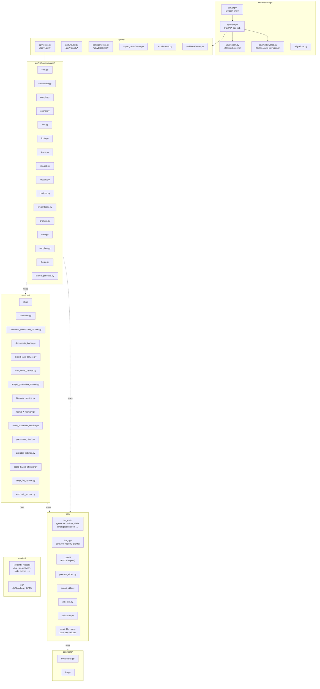
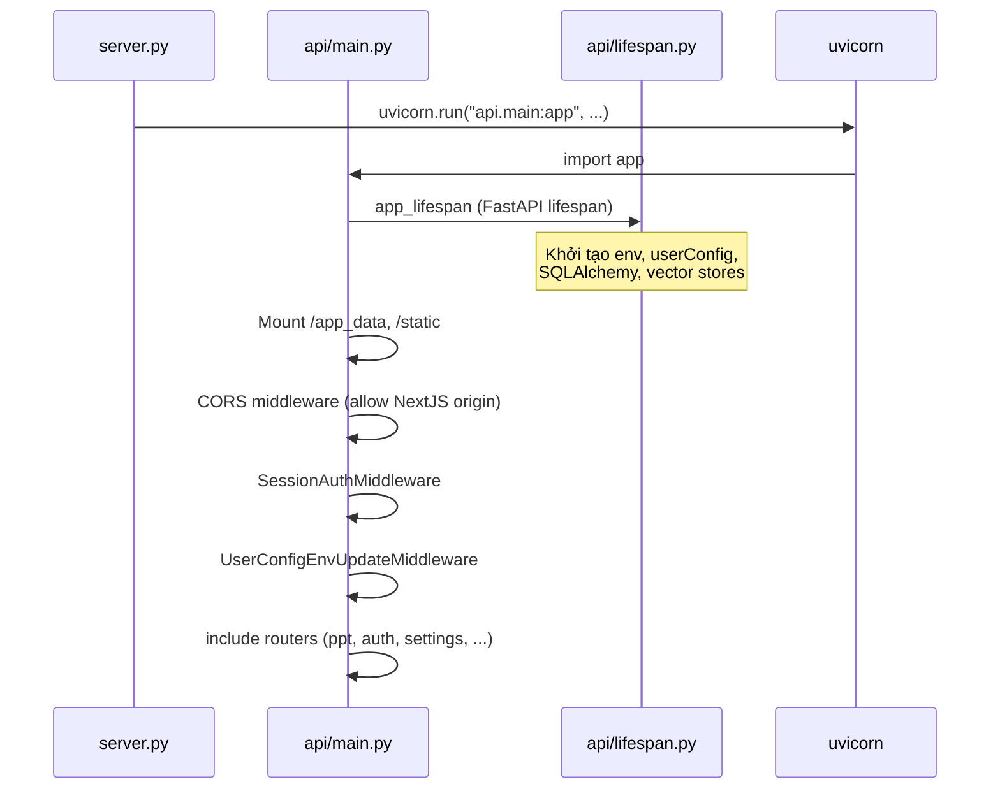
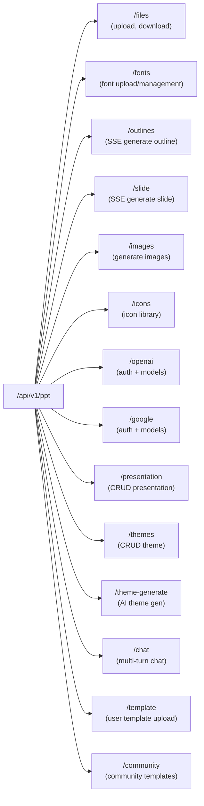
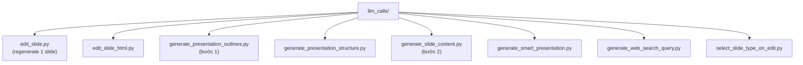
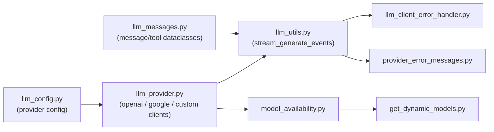
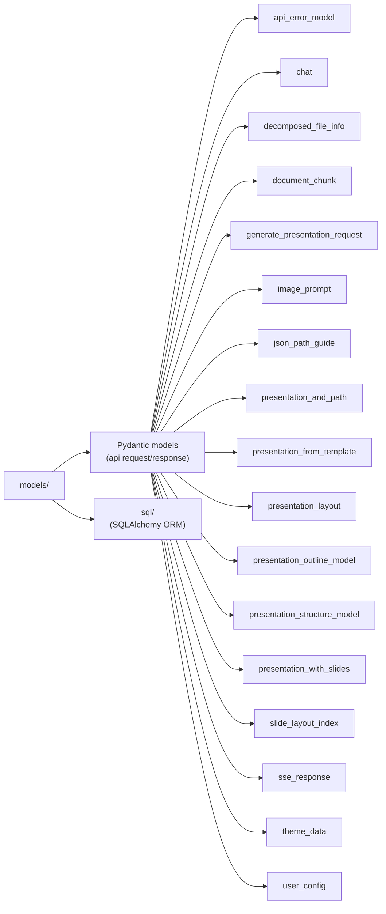
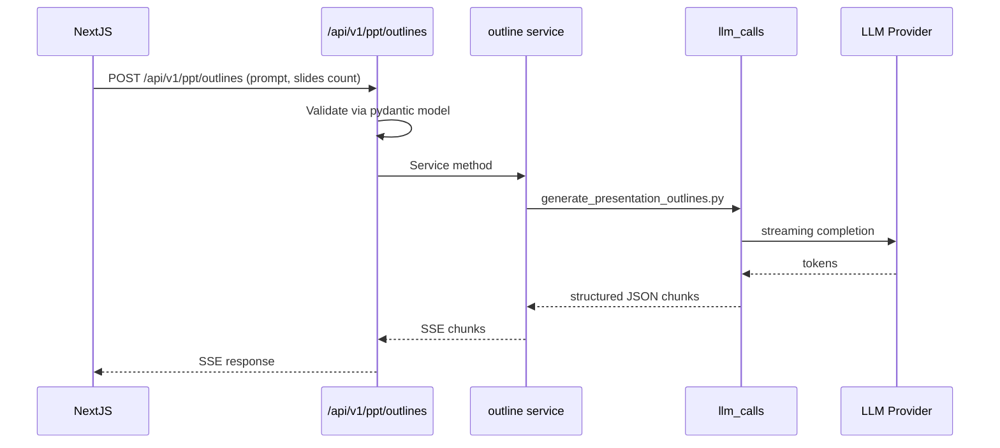

# Level 3 — FastAPI Backend (Python)

## 📂 Sơ đồ tổng thể FastAPI

## 🚀 App initialization (`api/main.py`)

## 🌐 Routers (`api/v1/`)

### PPT Router — `api/v1/ppt/router.py`

Prefix: `/api/v1/ppt`. Đây là router lớn nhất, chứa toàn bộ logic nghiệp vụ:

### Auth Router — `api/v1/auth/`

OAuth2 PKCE flow, session-based. There is **no admin persona**: every signed-in user is the same role. `bootstrap.py` seeds a normal user (the legacy first-admin bootstrap is renamed to `bootstrap_database_user`).
- `assets.py` — auth assets
- `bootstrap.py` — bootstrap first user from `AUTH_USERNAME`/`AUTH_PASSWORD`
- `config.py` — auth config
- `context.py` — auth context (owner_id only)
- `internal.py` — internal routes
- `presenton_oauth.py` — OAuth provider
- `principal.py` — current user principal
- `rate_limit.py` — rate limiting
- `router.py` — auth routes (login/register/logout/status)
- `schemas.py` — pydantic schemas
- `token.py` — token management (Bearer tokens are current-user scoped)
- `users.py` — user management

### Settings Router — `api/v1/settings/router.py`

Per-user provider overlay:
- `GET /api/v1/settings/provider` — effective config (overlay ∪ process env)
- `PUT /api/v1/settings/provider` — save current user's overlay (sanitized)

The middleware loads the current user's overlay into a `ContextVar` so `get_*_env()` providers see overlay before `os.environ`. Overlay **does not** store `AUTH_*`, `DATABASE_URL`, `DISABLE_AUTH`, etc.

### Async Tasks — `api/v1/async_tasks/router.py`

Tracking cho async tasks (export, generation).

### Mock — `api/v1/mock/router.py`

Mock endpoints cho testing.

### Webhook — `api/v1/webhook/router.py`

External webhooks (Presenton Cloud integration).

## 🧩 Services layer (`services/`)

Service layer chứa **business logic**, được các endpoints gọi:

| Service | Vai trò |
|---------|---------|
| `database.py` | SQLAlchemy session, models |
| `chat/` | Multi-turn chat logic |
| `document_conversion_service.py` | Convert PDF/DOCX/PPTX → text |
| `documents_loader.py` | Load documents cho RAG |
| `export_task_service.py` | Background export tasks |
| `icon_finder_service.py` | Search vector icons |
| `image_generation_service.py` | AI image generation |
| `liteparse_service.py` | Wrap llama-index liteparse |
| `mem0_oss_memory.py` | Local memory layer |
| `mem0_presentation_memory_service.py` | Memory theo presentation |
| `office_document_service.py` | PowerPoint/Word document processing |
| `presenton_cloud.py` | Cloud integration |
| `presenton_cloud_persistence.py` | Cloud storage |
| `presenton_cloud_proxy.py` | Cloud proxy |
| `provider_settings.py` | LLM provider settings |
| `score_based_chunker.py` | Chunking cho RAG |
| `temp_file_service.py` | Temp file management |
| `webhook_service.py` | Webhook delivery |
| `concurrent_service.py` | Concurrency utils |

## 🛠️ Utils layer (`utils/`)

### LLM Calls (`utils/llm_calls/`)

Đây là các **prompt chains** chính của Presenton. Mỗi file là 1 bước trong pipeline sinh presentation.

### LLM Utils (`utils/llm_*.py`)

FastAPI gọi LLM bằng SDK native (`openai`, `google-genai`), không còn package `llmai`. Provider hợp lệ: `openai`, `google`, `custom` (OpenAI-compatible URL).

### OAuth (`utils/oauth/`)

OAuth2 PKCE helpers:
- `pkce.py` — PKCE helpers

### Other utils

| File | Vai trò |
|------|---------|
| `process_slides.py` | Pipeline xử lý slide sau khi LLM sinh |
| `export_utils.py` | Helpers cho export PPTX/PDF |
| `ppt_utils.py` | python-pptx helpers |
| `validators.py` | Validators chung |
| `parsers.py` | Parsers |
| `sse.py` | SSE helpers (Server-Sent Events) |
| `theme_utils.py` | Theme processing |
| `template_vision_errors.py` | Vision errors |
| `smart_slide_layout.py` | Smart layout selection |
| `web_search.py` | Web search provider |
| `icon_weights.py` | Icon ranking |
| `font_uploads.py` | Font upload |
| `download_helpers.py` | HTTP download |
| `image_provider.py` | Image gen provider |
| `image_generation_error.py` | Image gen errors |
| `latex_text.py` | LaTeX rendering |
| `mime_types.py` | MIME types |
| `path_helpers.py` | Path resolution |
| `asset_directory_utils.py` | Asset dirs |
| `datetime_utils.py` | Date utils |
| `dict_utils.py` | Dict utils |
| `dummy_functions.py` | Test fixtures |
| `error_handling.py` | Errors |
| `filename_utils.py` | Filename sanitization |
| `file_utils.py` | File utils |
| `outline_limits.py` | Outline limits |
| `outline_utils.py` | Outline processing |
| `runtime_limits.py` | Runtime limits |
| `schema_utils.py` | Schema utils |
| `set_env.py` | Env setup |
| `user_config.py`, `user_config_store.py` | User config |
| `get_env.py` | Env getters |
| `async_iterator.py` | Async iter helpers |
| `available_models.py` | Model registry (OpenAI / Gemini / custom URL) |
| `llm_messages.py` | Message/tool/response shapes thay `llmai.shared` |

## 📦 Models (`models/`)

## 📦 Constants (`constants/`)

| File | Vai trò |
|------|---------|
| `documents.py` | Doc config |
| `llm.py` | LLM defaults |
| `presentation.py` | Presentation defaults |

## 🗃️ Database (`alembic/` + `migrations.py`)

- Alembic migrations cho SQLAlchemy ORM
- `migrations.py` chạy upgrade on startup
- Database mặc định là **SQLite**

## 🖼️ Static assets (`static/` & `assets/`)

| Folder | Nội dung |
|--------|----------|
| `static/icons/` | SVG icon library (được fallback placeholder) |
| `static/themes/` | Theme assets |
| `assets/` | Icon vectorstore (JSON embeddings) |

## 📡 SSE streaming

Presenton dùng **Server-Sent Events** cho:
- Outline generation (real-time từng slide)
- Slide content generation
- Export progress

Helpers ở `utils/sse.py`.

## Một request điển hình: generate outline

