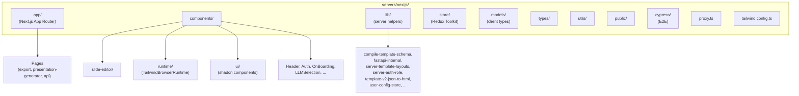
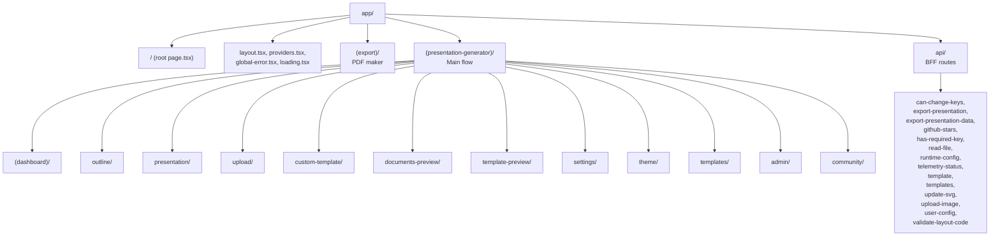
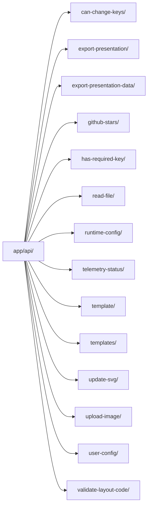
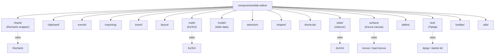
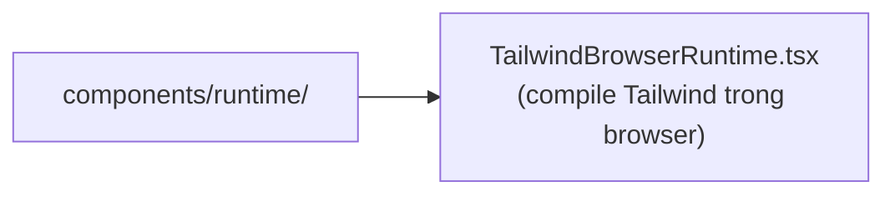
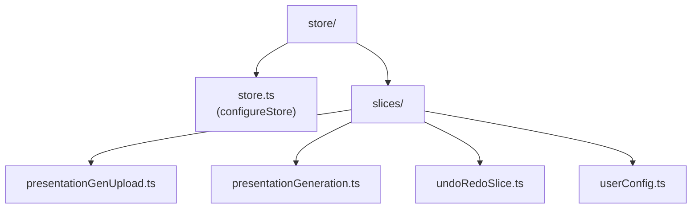
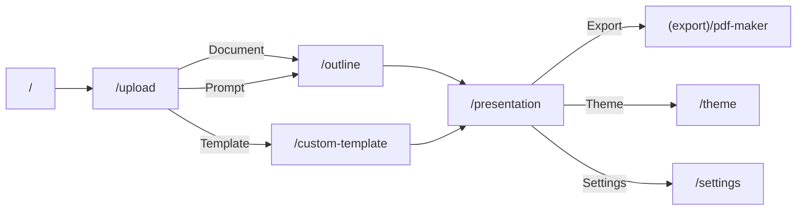
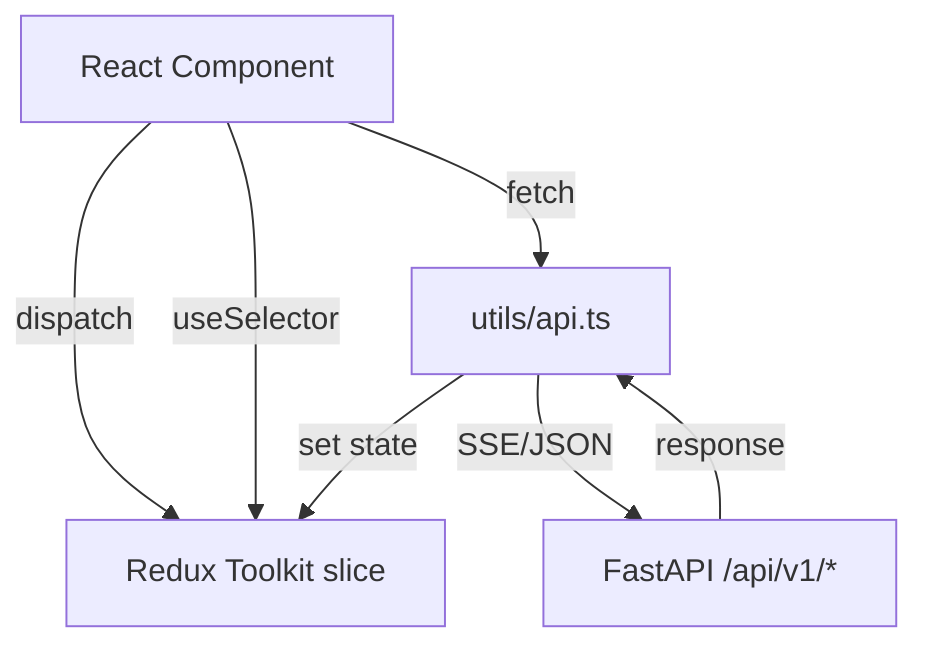
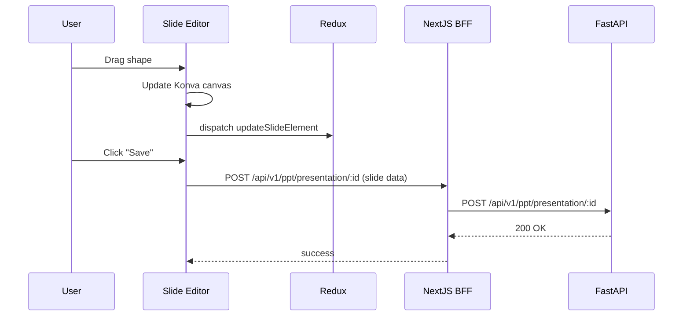

# Level 4 — NextJS Frontend

## 📂 Sơ đồ tổng thể NextJS

## 📄 App Router (`app/`)

NextJS dùng **App Router** (Next.js 16). Có 3 group chính:

### Route groups

| Route | Mục đích |
|-------|----------|
| `/` | Landing / entry page |
| `(presentation-generator)/(dashboard)` | Dashboard chính sau khi login |
| `(presentation-generator)/upload` | Upload document để generate |
| `(presentation-generator)/outline` | Review/edit outline (LLM đã sinh) |
| `(presentation-generator)/presentation` | Slide editor chính |
| `(presentation-generator)/custom-template` | Upload PPTX template riêng |
| `(presentation-generator)/template-preview` | Preview template trước khi dùng |
| `(presentation-generator)/documents-preview` | Preview uploaded document |
| `(presentation-generator)/theme` | Theme picker |
| `(presentation-generator)/templates` | Built-in template gallery |
| `(presentation-generator)/settings` | User settings (LLM keys, ...) |
| `(presentation-generator)/admin` | Admin panel |
| `(presentation-generator)/community` | Community templates |
| `(export)/pdf-maker` | PDF export bridge |

### BFF API routes (`app/api/`)

Mỗi BFF route là một **server function** NextJS (`route.ts`). Có 2 loại:

1. **BFF thuần** (validate, transform, format) — không gọi FastAPI
2. **BFF proxy** — gọi xuống FastAPI rồi trả về

## 🧩 Components (`components/`)

### Slide Editor — `components/slide-editor/`

Đây là phần phức tạp nhất của frontend — **canvas-based slide editor** giống Figma/Canva.

| Sub-folder | Vai trò |
|-----------|---------|
| `surface/` | **Canvas rendering** với Konva — render shape, image, text, charts |
| `state/` | Reducer quản lý slide state (drag, resize, undo/redo) |
| `toolbar/` | UI toolbar (insert, format, align) |
| `text/` | Rich text editor (Tiptap) |
| `shapes/` | Shape primitives (rect, circle, line) |
| `tables/` | Table editor |
| `charts/` | Chart renderer (Recharts) |
| `math/` | LaTeX math (KaTeX) |
| `selection/` | Selection handles |
| `clipboard/` | Copy/paste |
| `events/` | Event system |
| `shortcuts/` | Keyboard shortcuts |
| `insert/` | Insert new elements |
| `importing/` | Import từ PPTX/HTML |
| `model/` | Slide data model |
| `utils/` | Editor utils |
| `types.ts` | Type definitions |

### Runtime — `components/runtime/`

Cho phép user-defined template dùng Tailwind utilities mà không cần build-time.

### UI (`components/ui/`)

shadcn-style components:
- `accordion`, `button`, `card`, `chart`, `collapsible`, `command`, `dialog`, `dropdown-menu`, `input`, `label`, `loader`, `popover`, `progress`, `radio-group`, `scroll-area`, `select`, `separator`, `sheet`, `skeleton`, `slider`, `sonner`, `switch`, `table`, `tabs`, `textarea`, `toggle`, `tooltip`

### Feature components (`components/`)

| File | Vai trò |
|------|---------|
| `Header.tsx` | Top bar |
| `Home.tsx` | Home page content |
| `Wrapper.tsx` | Layout wrapper |
| `Announcement.tsx` | Announcement banner |
| `MarkDownRender.tsx` | Markdown → HTML (sanitized) |
| `ToolTip.tsx` | Tooltip wrapper |
| `BackBtn.tsx` | Back button |
| `LLMSelection.tsx` | Chọn LLM: OpenAI / Google / custom (OpenAI-compatible) |
| `OpenAIConfig.tsx`, `GoogleConfig.tsx`, `CustomConfig.tsx`, `OpenAICompatibleImageFields.tsx` | Provider-specific config UI |
| `ImageSelectionConfig.tsx` | Image gen provider |
| `ChatGptAuthRedirectHandler.tsx` | OAuth callback |
| `ConfigurationInitializer.tsx` | Init config khi load page |
| `PostHogInitializer.tsx` | Error-reporting init (fail-closed PostHog; see `docs/superpowers/specs/2026-08-26-posthog-error-reporting-design.md`) |
| `Auth/` | Auth components |
| `OnBoarding/` | Onboarding flow |

## 🗄️ Store (`store/`)

Redux Toolkit:

- `presentationGeneration` — trạng thái generation (outline, slides, layouts)
- `presentationGenUpload` — uploaded file state
- `undoRedo` — undo/redo stack cho slide editor
- `userConfig` — LLM keys, settings

## 📚 Lib (`lib/`)

Server-side helpers chỉ chạy trên server (NextJS server components):

| File | Vai trò |
|------|---------|
| `compile-template-schema.ts` | Compile user template schema |
| `default-schemes.ts` | Default schemes |
| `fastapi-internal.ts` | Server-side FastAPI client |
| `math.ts` | Math helpers |
| `readable-local-file.ts` | Read local file |
| `run-bundled-presentation-export.ts` | Run export runtime |
| `runtime-limits.ts` | Limits |
| `server-auth-role.ts` | Auth role checks |
| `server-template-layouts.ts` | Load template layouts |
| `svg-color.ts` | SVG color helpers |
| `tailwind-browser.ts` | Browser Tailwind |
| `template-v2-json-to-html.ts` | Template → HTML |
| `user-config-store.ts` | Server-side user config store |
| `utils.ts` | cn() helper |
| `validate-layout-code.ts` | Validate user layout code |
| `chart-browser.ts` | Chart browser helpers |

## 🛠️ Utils (`utils/`)

| File | Vai trò |
|------|---------|
| `api.ts` | Fetch helpers |
| `apiErrorMessages.ts` | Error messages |
| `auth.ts`, `serverAuth.ts`, `authErrors.ts` | Auth helpers |
| `analytics.ts`, `posthog.ts` | Error reporting (`analytics.ts` = error sanitizer; `posthog.ts` = fail-closed PostHog wrapper, crash + generate/export/stream/save only) |
| `chatgptAuth.ts` | ChatGPT OAuth client |
| `constant.ts` | Constants |
| `error_helpers.ts` | Error helpers |
| `image-url-converter.ts` | Image URL convert |
| `presentationLimits.ts` | Limits |
| `providerConstants.ts` | Provider constants |
| `providerUtils.ts` | Provider helpers |
| `settingsAccess.ts` | Settings access |
| `storeHelpers.ts` | Store helpers |

## 📝 Types (`types/`)

- `global.d.ts` — global TS types
- `llm_config.ts` — LLM config types
- `presentation.ts` — Presentation types

## 🏛️ Models (`models/`)

- `errors.ts` — Error types

## 📦 Public (`public/`)

Static assets: favicon, icons, fonts.

## 🧪 Cypress (`cypress/`)

E2E tests.

## 🎨 Tailwind (`tailwind.config.ts` + `components.json`)

Custom design system — dùng shadcn-style với CSS variables cho theming.

## 📐 Routing flow chính

## 🔌 State management pattern

## 🎯 Slide editor data flow

