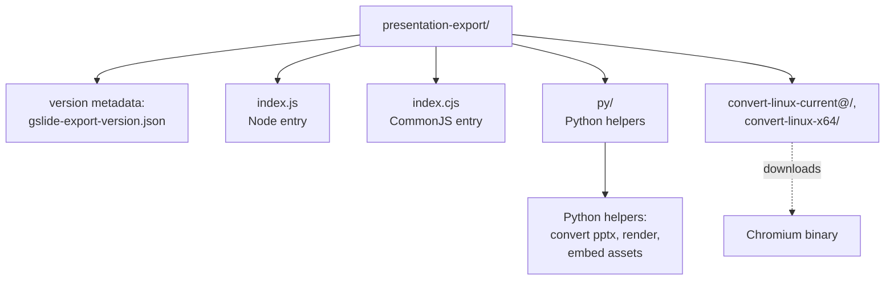
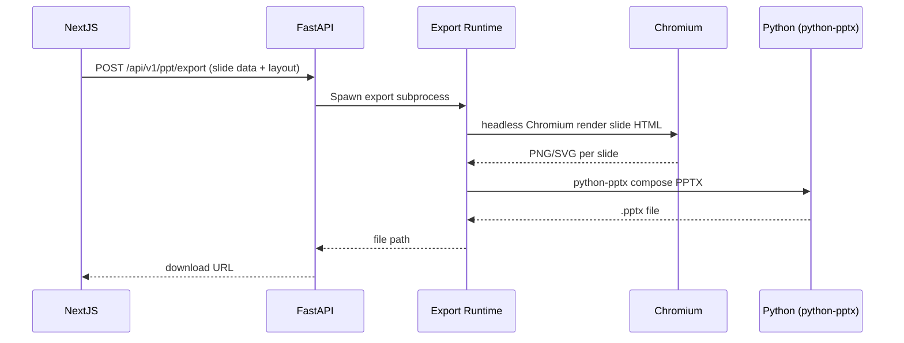

# Level 5 — Presentation Export & Document Extraction

Level này mô tả 2 thành phần độc lập với web stack:

1. **`presentation-export/`** — Chromium-based runtime dùng để render PPTX/PDF
2. **`document-extraction-liteparse/`** — Workspace con dùng để parse PDF/DOCX/PPTX thành text

## 📦 Presentation Export (`presentation-export/`)

### Sơ đồ



### Vai trò

`presentation-export` là một **package độc lập** (npm package) dùng để:
- Render slide HTML → PPTX
- Render slide HTML → PDF
- Dùng Chromium dưới nền (Playwright/Puppeteer-style)
- Embed fonts, images, charts

### Version pinning

Phiên bản được pin qua `package.json` (root) → `presentationExportVersion`. Build script ở `scripts/sync-presentation-export.cjs` download đúng version đó.

```bash
npm run sync:presentation-export    # Download
npm run check:presentation-export   # Verify CI/local
```

### Luồng export PPTX



### Runtime layout

Trên Docker build (`Dockerfile.api`):

1. `sync-presentation-export.cjs --force` download release asset theo `TARGETARCH`
2. Giải nén → `presentation-export/` chứa:
   - `index.js` (ESM) + `index.cjs` (CommonJS, copy từ `index.js`)
   - `py/` — Python helpers
   - `convert-linux-current` (symlink) → `convert-linux-x64` (hoặc `convert-linux-arm64`)
3. `convert` binary được chmod `+x`

## 📄 Document Extraction (`document-extraction-liteparse/`)

Workspace con dùng `@llamaindex/liteparse` để parse PDF, DOCX, PPTX thành text. Được dùng bởi `services/liteparse_service.py` ở FastAPI.


Runner script nằm ở `scripts/liteparse_runner.mjs` và được copy vào `/app/document-extraction-liteparse/liteparse_runner.mjs` lúc Docker build.

## 🏗️ Build matrix

| Target | Lệnh | Output |
|--------|------|--------|
| Dev (Web) | `docker compose up development --build` | nginx + Next + FastAPI + SearXNG, hot-reload |
| Docker production | `docker compose up production --build` | nginx + Next + FastAPI + SearXNG (CPU; không GPU) |
| Sync export runtime | `npm run sync:presentation-export` | Download `presentation-export/` |
| Verify export | `npm run check:presentation-export` | CI gate |