# Data Flow — End-to-End

File này mô tả các luồng dữ liệu chính xuyên suốt các layer của Presenton.

## 1️⃣ Generate outline từ prompt

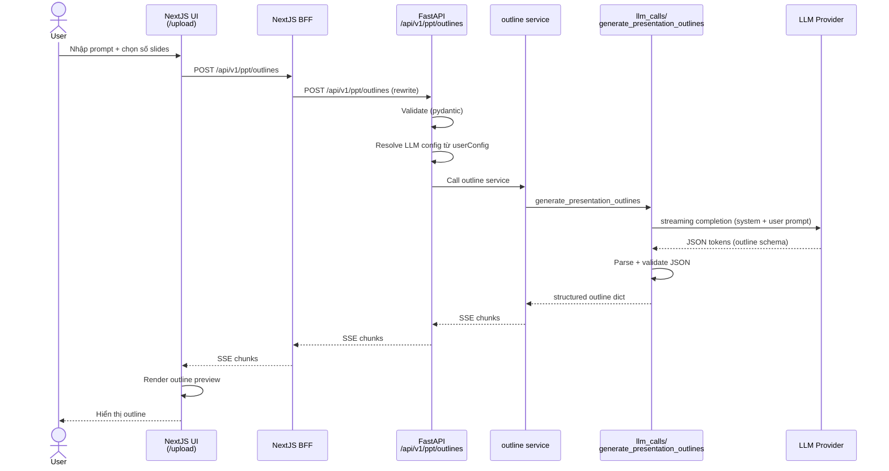

## 2️⃣ Generate slide content

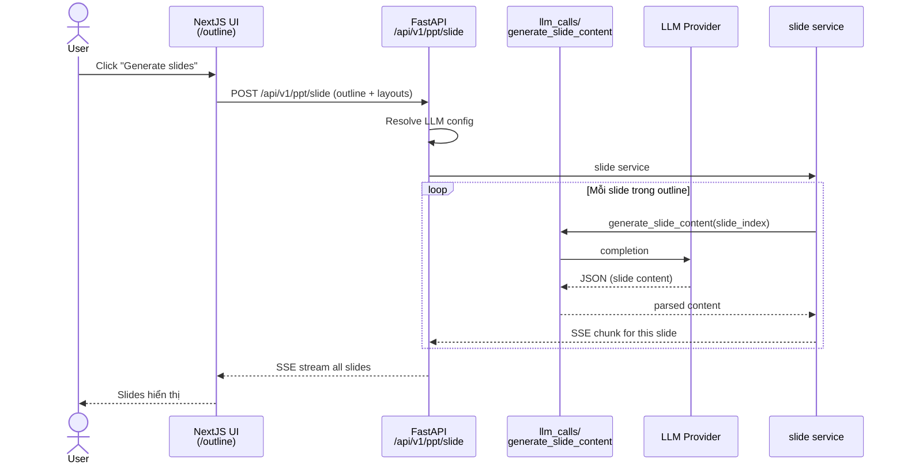

## 3️⃣ Edit slide (slide editor)

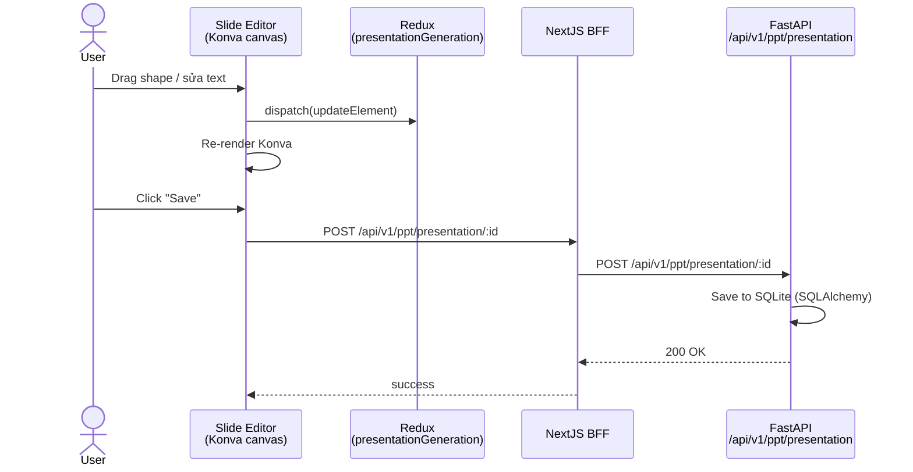

## 4️⃣ Upload document → RAG context

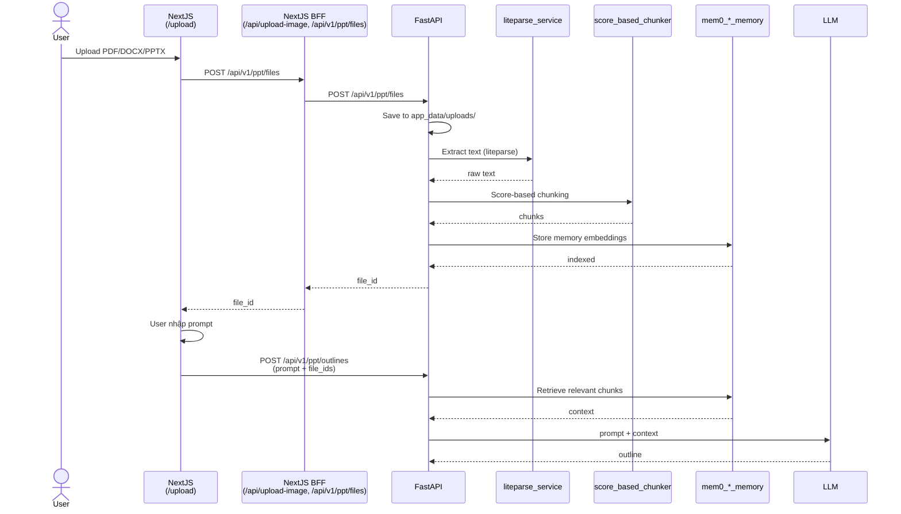

## 5️⃣ Image generation (nếu user bật)

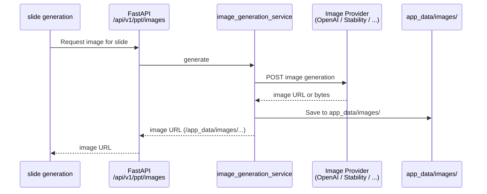

## 6️⃣ Theme generation (AI theme)

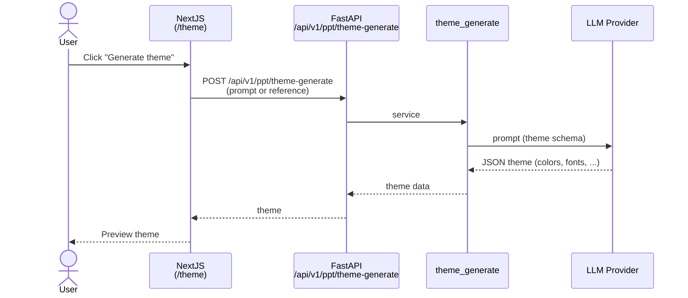

## 7️⃣ Export PPTX / PDF

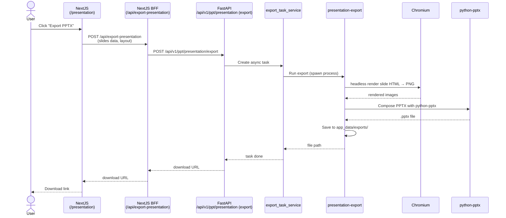

## 8️⃣ Auth flow (OAuth2 PKCE)

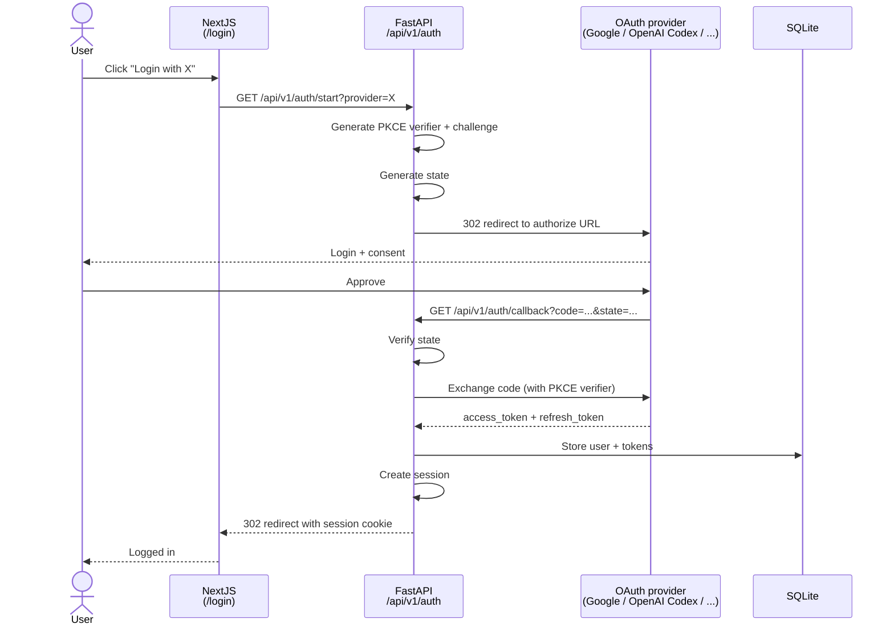

## 9️⃣ Multi-turn chat editing

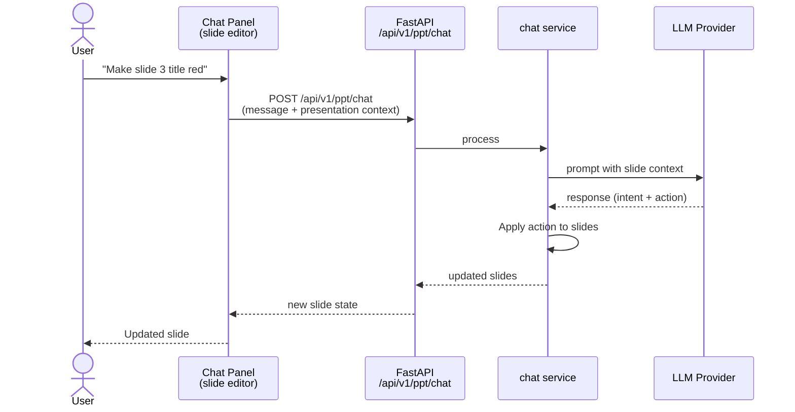

## 🔟 Community template browsing

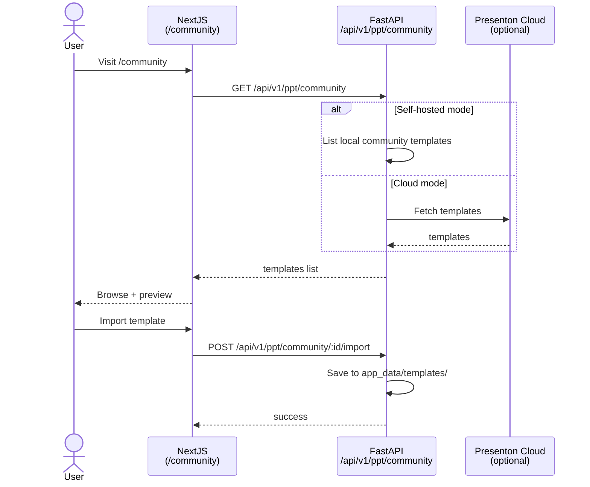

## 📊 Tổng kết luồng dữ liệu

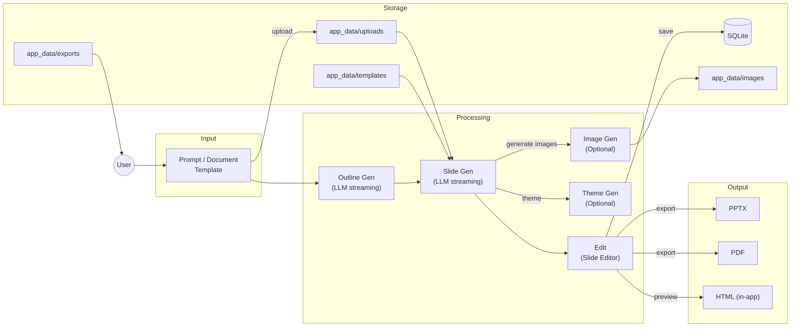

## 🔑 Điểm chính cần nhớ

1. **Mọi LLM call là streaming** (SSE) — UI cập nhật real-time.
2. **`/api/v1/*` luôn qua NextJS proxy** — không có cách nào browser gọi trực tiếp FastAPI trong prod.
3. **`app_data/` là single source of truth** cho runtime state (uploads, exports, fonts, templates).
4. **SQLite** lưu user config, presentations, themes — dùng Alembic migrations.
5. **Export là async** — có thể track qua `/api/v1/async-tasks`.
6. **Slide editor state** ở Redux (client) + slide layout code là **user-defined Tailwind+TS** (compile runtime qua Babel).
7. **Templates** có thể là built-in (trong `/templates/`) hoặc user-uploaded (custom-template flow).
