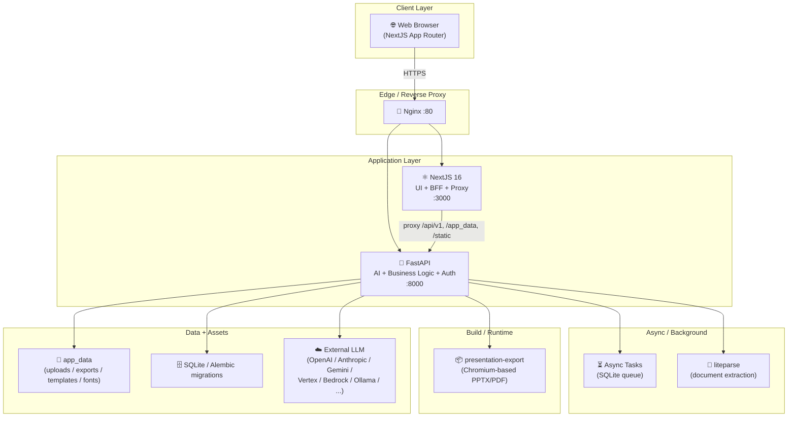

# Kiến trúc dự án Presenton

Tài liệu này mô tả cấu trúc các **level** của dự án **Presenton** — một open-source AI Presentation Generator.

## � Mục tiêu

Cung cấp cái nhìn t�ng quan, phân tầng và dễ hiểu về kiến trúc dự án, giúp các thành viên mới (developer, contributor, ops) có thể:

- Nắm được bức tranh toàn cảnh của hệ thống
- Hiểu được cách các thành phần tương tác với nhau
- Tìm được file/module liên quan đến một tính năng cụ thể nhanh chóng
- Định hướng khi thêm/sửa module mới

## � Mục lục các level

| Level | Tài liệu | Phạm vi |
|-------|----------|---------|
| 0 | [00-overview.md](./00-overview.md) | Tổng quan: tech stack, kiểu triển khai, entry points |
| 1 | [01-level-workspace.md](./01-level-workspace.md) | Root workspace: monorepo, các thư mục chính |
| 2 | [02-level-servers.md](./02-level-servers.md) | Hai server chính: FastAPI + NextJS |
| 3 | [03-level-fastapi.md](./03-level-fastapi.md) | FastAPI backend (Python) chi tiết |
| 4 | [04-level-nextjs.md](./04-level-nextjs.md) | NextJS frontend chi tiết |
| 5 | [05-level-export-runtime.md](./05-level-export-runtime.md) | Presentation Export runtime (Chromium-based PPTX/PDF) |
| - | [06-data-flow.md](./06-data-flow.md) | Data flow end-to-end |

## 🏗️ Sơ đồ tổng quan (1 trang)

## 🚀 Quick start cho người mới

1. Đọc [00-overview.md](./00-overview.md) để hiểu tech stack & kiểu triển khai
2. Đọc [01-level-workspace.md](./01-level-workspace.md) để biết monorepo được tổ chức thế nào
3. Đọc [03-level-fastapi.md](./03-level-fastapi.md) hoặc [04-level-nextjs.md](./04-level-nextjs.md) tùy theo bạn làm backend hay frontend
4. Đọc [06-data-flow.md](./06-data-flow.md) để hiểu một presentation được tạo ra như thế nào
